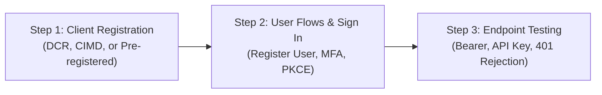

# Apigee OAuth 2.1 & OIDC Interactive Client Tester

An interactive, browser-based single-page test application (SPA) designed to test and demo the **`auth-oauth-server`** (Identity Provider & OAuth Authorization Server) and **`auth-oauth-verify`** (MCP & API Token Verification) feature templates.

---

## Architecture & Streamlined 3-Step Workflow

The tester is designed with **progressive disclosure** so you are never overwhelmed with irrelevant tabs or out-of-order steps:



1. **Step 1: Client Registration (Front & Center when unregistered)**:
   - **Why?** An OAuth 2.1 authorization server cannot issue tokens or display user login screens without knowing which client application is requesting them (`client_id` and redirect URI validation).
   - Downstream steps (User Flows and Endpoint Testing) remain safely disabled or locked until a valid client is registered or configured.
   - **Supported Options**:
     - 🚀 **1-Click Dynamic Client Registration (RFC 7591 - DCR)**: Automatically registers a new developer app in Apigee.
     - 🌐 **Client Identity Metadata Document (CIMD)**: Spec-compliant URL-based Client ID (e.g., `https://example.com/client.json`). Apigee dynamically fetches and verifies client metadata from the document URL.
     - 🛠️ **Manual Pre-registered Credentials**: Plug in an existing Apigee developer app's `client_id` and optional `client_secret`.

2. **Step 2: User Flows & Authentication**:
   - **Why?** Once a client is recognized by Apigee, test user accounts can be registered and users can authenticate via OAuth 2.1 Authorization Code Flow with PKCE.
   - **User Flows**: Register User (`/register-user`), Setup TOTP MFA (`/mfa-setup`), Reset Password (`/reset-password`), Delete Account (`/delete-account`).
   - **Authentication**: Initiate PKCE browser login, acquire tokens, test refresh tokens, introspect tokens, or revoke tokens.

3. **Step 3: Endpoint Testing & Claims**:
   - **Why?** Now that you hold valid Bearer tokens, verify access to downstream APIs or MCP servers protected by `auth-oauth-verify`.
   - **Supported Options**:
     - **Bearer Token**: Verifies successful access with scopes and token verification.
     - **None / Unauthenticated**: Verifies that protected endpoints correctly reject unauthorized requests with `401 Unauthorized`.
     - **API Key**: Verifies access using `x-api-key` header when API key validation is active.
   - **Token Claims & UserInfo**: Inspect decoded JWT claims (`sub`, `email`, `exp`, `scope`) and query `/userinfo`.

---

## Automatic Configuration Persistence

- **Zero-click Auto-Save**: Any changes made in the settings sidebar (Server URL, Client ID, Client Secret, Scopes, API Key) are automatically debounced and saved to browser `localStorage`. A green *"Saved"* indicator pulses to confirm persistence.
- **Reset Controls**:
  - **Reset Client Registration**: Clears only the active client ID, secrets, and tokens, returning the UI to Step 1.
  - **Reset All State**: Completely resets all settings, endpoints, and tokens to factory defaults.

---

## Do You Need a Python Server? (Can This Just Be a Web Page?)

### Short Answer: **No, a Python server is not required!**

Because both **`auth-oauth-server`** and **`auth-oauth-verify`** feature templates support **CORS** (Cross-Origin Resource Sharing) via Apigee's `CORS-SetCors` policy, web browsers can issue direct `fetch()` calls to Apigee endpoints from any origin (`GET`, `POST`, `OPTIONS`).

### How You Can Run the Client:
1. **Direct Static Web Page**:
   - You can host `index.html`, `styles.css`, and `app.js` on **any** static host: GitHub Pages, Cloud Storage bucket (GCS), Firebase Hosting, AWS S3, or Nginx.
2. **Local Static Server**:
   - Python standard library: `python3 -m http.server -d tests/clients 8080`
   - Node / npm: `npx serve tests/clients -p 8080`
3. **Bundled `server.py`**:
   - Provided purely as a convenience helper for local testing if you don't have Node installed or if you need an optional transparent proxy (`/api-proxy`) when testing against Apigee instances that have custom CORS limitations.

---

## Quickstart

### 1. Launch the Client

Using Python:
```bash
python3 tests/clients/server.py 8080
```
Or any static web server:
```bash
python3 -m http.server -d tests/clients 8080
```

Open your browser at:
👉 **[http://localhost:8080](http://localhost:8080)**

---

## Step-by-Step Testing Guide

### 1. Step 1: Register Your Client
- Verify the **OAuth / OIDC Server URL** in the sidebar.
- Choose your registration method:
  - **Option A (DCR)**: Click **"Register Client with DCR"**. Apigee registers a new developer app and automatically populates the Client ID.
  - **Option B (CIMD)**: Switch to the **Client Identity Metadata (CIMD)** tab, enter your metadata URL (or click "Use Sample URL"), and click **"Activate CIMD Client"**.
  - **Option C (Manual)**: Switch to the **Manual Credentials** tab, enter your existing Apigee app's Client ID, and click **"Apply Client Credentials"**.
- The app automatically marks Step 1 complete and advances to Step 2!

### 2. Step 2: Register a User & Sign In
- In the **Self-Service User Flows** panel:
  - Click **"Register User"** to open `/register-user` in a new tab. Create your test account.
  - Optionally click **"Setup MFA"** to register an authenticator app (e.g. Aegis, Google Authenticator) using the dynamic QR code or secret.
- In the **Authentication** panel:
  - Click **"Sign In with Apigee OIDC (PKCE)"**.
  - Log in with your registered user credentials and optional MFA code.
  - Upon redirection back, tokens are automatically exchanged and stored. The app automatically advances to Step 3!

### 3. Step 3: Test Protected Endpoints & Inspect Claims
- Select a target endpoint from the sidebar (e.g., `MCP Protected Resource Metadata`, `MCP JSON-RPC Tools Request`, or `OIDC UserInfo`).
- Select your authorization mode:
  - **Bearer Token**: Sends `Authorization: Bearer <token>`.
  - **None**: Sends the request unauthenticated to verify `401 Unauthorized` enforcement.
  - **API Key**: Sends `x-api-key`.
- Click **"Send Request"** to view live response status, latency, headers, and body.
- Switch to the **"Decoded Claims & Profile"** subtab to inspect decoded JWT claims or query `/userinfo`.
